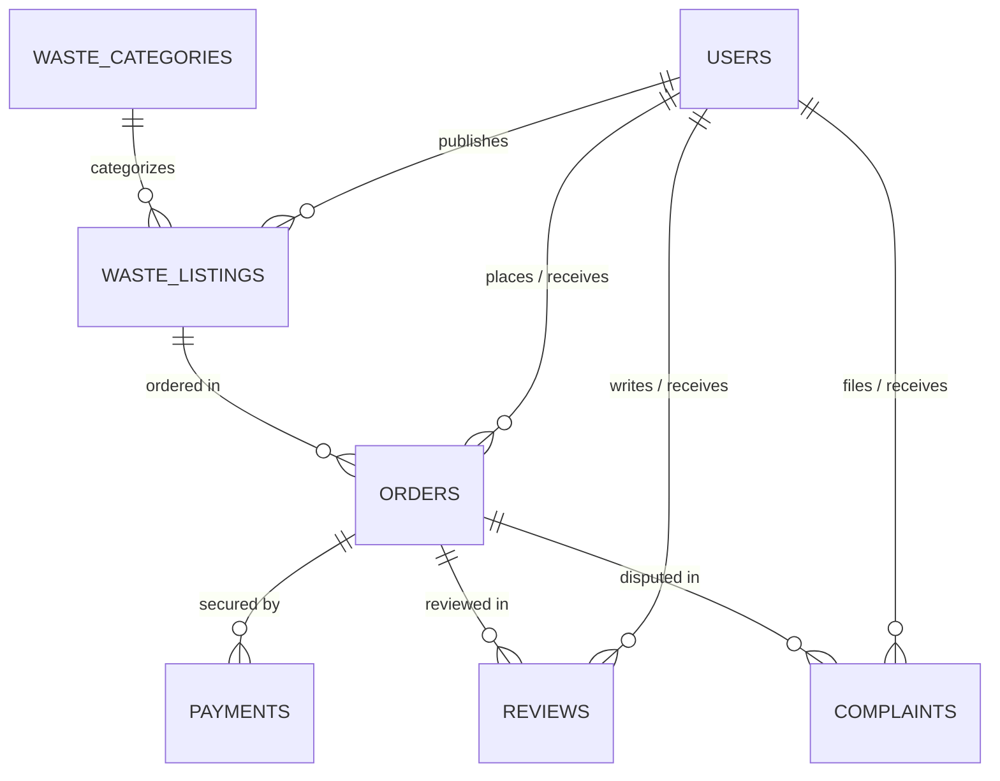

# Database Schema Reference — Smart Agri Waste Marketplace

This document details the collections/tables, relationships, indices, and schema definitions for the platform.

---

## 1. Entity Relationship Overview



---

## 2. Collections & Schema Details

### 2.1 `users`
Represents registered Farmers, Industrial Buyers, and System Administrators.

```json
{
  "_id": "ObjectId",
  "id": "usr-farmer-1",
  "name": "Ramesh Patel",
  "email": "ramesh@greenfarmagro.in",
  "passwordHash": "$2a$10$...",
  "role": "FARMER | BUYER | ADMIN",
  "phone": "+91 98765 43210",
  "farmName": "GreenFarm Agro & Dairy",
  "companyName": "AgroFeed & Cattle Nutrition Ltd",
  "businessType": "Individual Farmer / FPO",
  "gstin": "33AABCG1234F1Z8",
  "location": "Pollachi, Coimbatore, Tamil Nadu",
  "state": "Tamil Nadu",
  "district": "Coimbatore",
  "pincode": "642001",
  "lat": 10.6586,
  "lng": 77.0084,
  "verified": {
    "phone": true,
    "email": true,
    "identity": true,
    "gst": true
  },
  "rating": 4.9,
  "reviewsCount": 46,
  "totalEarnings": 284500,
  "totalPurchases": 0,
  "isSuspended": false,
  "createdAt": "2024-03-15T00:00:00.000Z"
}
```

### 2.2 `waste_listings`
Represents agricultural waste lots listed by farmers.

```json
{
  "_id": "ObjectId",
  "id": "LST-1001",
  "title": "Premium Dry Paddy Straw Bales (Round Machine Baled)",
  "category": "paddy-straw",
  "categoryName": "Paddy / Rice Straw",
  "crop": "Paddy (Ponni Rice)",
  "description": "High-quality sun-dried golden rice straw bales. Zero soil contamination.",
  "quantity": 12.5,
  "unit": "Tons",
  "price": 4200,
  "priceUnit": "Per Ton",
  "minOrderQty": 2.0,
  "availableQty": 12.5,
  "moisture": "11%",
  "qualityGrade": "Grade A (Golden Dry)",
  "packaging": "Machine Baled (25kg Bales)",
  "storageType": "Covered Shed Storage",
  "loadingAssistance": "Yes (Tractor loader on-site)",
  "harvestDate": "2026-08-14",
  "expiryDate": "2027-02-14",
  "images": [
    "https://images.unsplash.com/photo-1574943320219-553eb213f72d?auto=format&fit=crop&w=800&q=80"
  ],
  "seller": {
    "id": "usr-farmer-1",
    "name": "Ramesh Patel",
    "farmName": "GreenFarm Agro & Dairy",
    "phone": "+91 98765 43210"
  },
  "location": "Pollachi, Tamil Nadu",
  "state": "Tamil Nadu",
  "district": "Coimbatore",
  "pincode": "642001",
  "lat": 10.6586,
  "lng": 77.0084,
  "status": "Approved",
  "isApproved": true,
  "views": 412,
  "createdAt": "2026-08-15"
}
```

### 2.3 `orders`
Represents transactions between buyers and sellers with 9-stage fulfillment tracking.

```json
{
  "_id": "ObjectId",
  "id": "AGW-10245",
  "listingId": "LST-1001",
  "listingTitle": "Premium Dry Paddy Straw Bales",
  "category": "paddy-straw",
  "quantity": 5.0,
  "unit": "Tons",
  "unitPrice": 4200,
  "subtotal": 21000,
  "transportationFee": 2400,
  "platformFee": 420,
  "taxGst": 1050,
  "totalAmount": 24870,
  "status": "In Transit",
  "statusStep": 6,
  "paymentStatus": "Paid (UPI)",
  "paymentMethod": "UPI (Google Pay)",
  "transactionId": "TXN-UPI-9847291038",
  "createdAt": "2026-08-16 10:30 AM",
  "pickupDate": "2026-08-17 09:00 AM",
  "estimatedDelivery": "2026-08-18 04:30 PM",
  "seller": {
    "id": "usr-farmer-1",
    "name": "Ramesh Patel",
    "farmName": "GreenFarm Agro",
    "phone": "+91 98765 43210",
    "pickupAddress": "Farm Gate #3, Pollachi, TN - 642001"
  },
  "buyer": {
    "id": "usr-buyer-1",
    "name": "Rajesh Sharma",
    "company": "AgroFeed Ltd",
    "phone": "+91 98450 67890",
    "deliveryAddress": "SIDCO Industrial Estate, Coimbatore, TN - 641021"
  },
  "logistics": {
    "carrier": "AgriLogistics Express",
    "driverName": "Murugesan K.",
    "driverPhone": "+91 98421 88776",
    "vehicleNumber": "TN-38-AX-4821",
    "currentLocation": "Kinathukadavu Toll Plaza (18 km from destination)",
    "lat": 10.8236,
    "lng": 77.0185
  },
  "timeline": [
    { "step": "Order Placed", "time": "16 Aug, 10:30 AM", "completed": true },
    { "step": "Payment Confirmed", "time": "16 Aug, 10:32 AM", "completed": true },
    { "step": "Seller Accepted", "time": "16 Aug, 11:15 AM", "completed": true },
    { "step": "Pickup Scheduled", "time": "17 Aug, 08:30 AM", "completed": true },
    { "step": "Waste Collected", "time": "17 Aug, 09:15 AM", "completed": true },
    { "step": "In Transit", "time": "17 Aug, 11:00 AM", "completed": true, "active": true },
    { "step": "Delivered", "time": "Est. 18 Aug, 04:30 PM", "completed": false },
    { "step": "Completed", "time": "Pending confirmation", "completed": false }
  ]
}
```

### 2.4 `reviews`
Multi-criteria star ratings and qualitative written feedback.

```json
{
  "_id": "ObjectId",
  "id": "REV-101",
  "orderId": "AGW-10247",
  "sellerId": "usr-farmer-4",
  "sellerName": "Gurpreet Singh",
  "buyerId": "usr-buyer-6",
  "buyerName": "Kavita Ramachandran (TerraPure)",
  "overallRating": 5,
  "qualityRating": 5,
  "communicationRating": 5,
  "deliveryRating": 5,
  "date": "12 August 2026",
  "comment": "Excellent quality aged cow manure with minimal moisture and zero weed seeds.",
  "wasteType": "Cow Dung Manure",
  "helpfulCount": 14
}
```

### 2.5 `complaints`
Dispute arbitration cases with evidence attachment.

```json
{
  "_id": "ObjectId",
  "id": "CMP-401",
  "orderId": "AGW-10248",
  "userId": "usr-buyer-1",
  "userName": "Rajesh Sharma",
  "complaintType": "Quality Mismatch",
  "description": "Moisture content in delivered groundnut shell batch was 18% instead of 8%.",
  "attachment": "lab_moisture_report.pdf",
  "status": "Under Review",
  "adminResponse": "Admin reviewing lab report with seller.",
  "createdAt": "2026-08-16",
  "resolvedDate": null
}
```

---

## 3. Database Indexes

Recommended MongoDB indexes for performance:

```javascript
db.waste_listings.createIndex({ title: "text", description: "text", crop: "text" });
db.waste_listings.createIndex({ category: 1, status: 1 });
db.waste_listings.createIndex({ state: 1, district: 1 });
db.waste_listings.createIndex({ price: 1 });
db.waste_listings.createIndex({ "seller.id": 1 });
db.orders.createIndex({ "seller.id": 1, status: 1 });
db.orders.createIndex({ "buyer.id": 1, status: 1 });
```
